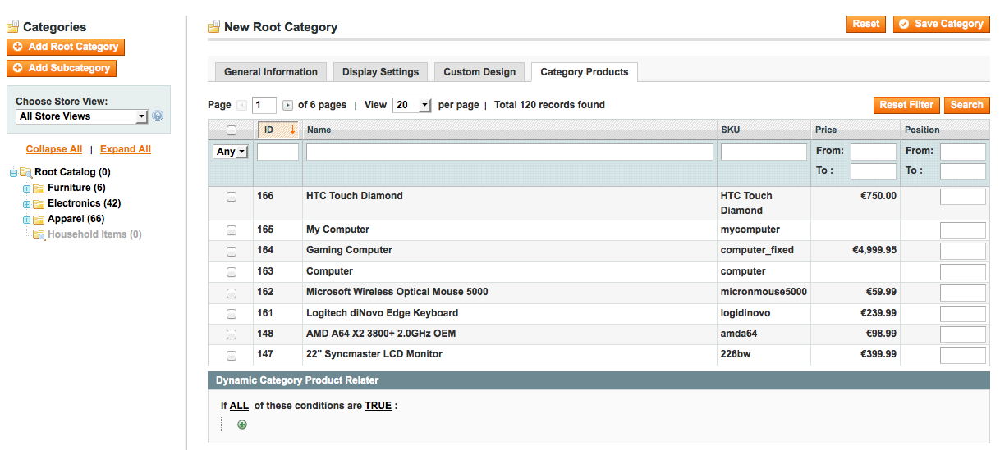

FireGento_DynamicCategory
=====================
Description
-----------
This extension enables you to dynamically add products to a specific category based on product attributes.

Facts
-----
- Version: 1.0.0
- [extension on GitHub](https://github.com/firegento/firegento-dynamiccategory)


Requirements
------------
- PHP >= 5.2.0
- Mage_Core

Compatibility
-------------
- Magento >= 1.5

Installation Instructions
-------------------------

### Via modman

- Install [modman](https://github.com/colinmollenhour/modman)
- Use the command from your Magento installation folder: `modman clone https://github.com/firegento/firegento-dynamiccategory`

### Via composer
- Install [composer](http://getcomposer.org/download/)
- Create a composer.json into your project like the following sample:

```json
{
    ...
    "require": {
        "firegento/dynamiccategory":"*"
    },
    "repositories": [
	    {
            "type": "composer",
            "url": "http://packages.firegento.com"
        }
    ],
    "extra":{
        "magento-root-dir": "./"
    }
}

```

- Then from your `composer.json` folder: `php composer.phar install` or `composer install`

### Manually
- You can copy the files from the folders of this repository to the same folders of your installation


### Installation in ALL CASES
1. Clear the cache, logout from the admin panel and then login again.
2. You can now dynamically add products to categories based on attributes.

Usage
-----

The module adds a new section "Dynamic Category Product Relater" at the tab "Category Products" while reading or editing a category into the backend.
You can define rules for products to be included in the category.



If a rule should be defined according to a specific attribute, that attribute needs to be enabled for "Use for Promo Rule Conditions" in its attribute configuration (See Catalog > Attributes > YOUR ATTRIBUTE > Edit it).


Support
-------
If you have any issues with this extension, open an issue on [GitHub](https://github.com/firegento/firegento-dynamiccategory/issues).

Contribution
------------
Any contribution is highly appreciated. The best way to contribute code is to open a [pull request on GitHub](https://help.github.com/articles/using-pull-requests).

Developer
---------
[http://firegento.com](http://firegento.com)  
[@firegento](https://twitter.com/firegento)

Licence
-------
[GNU General Public License, version 3 (GPLv3)](http://opensource.org/licenses/gpl-3.0)

Copyright
---------
(c) 2012 FireGento
