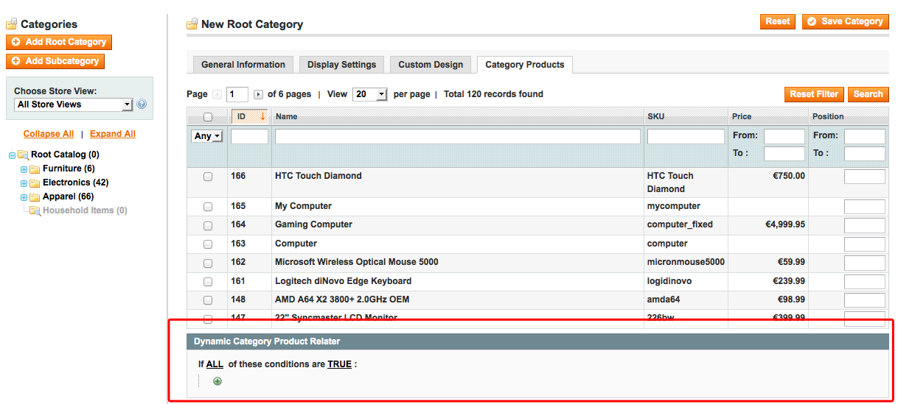
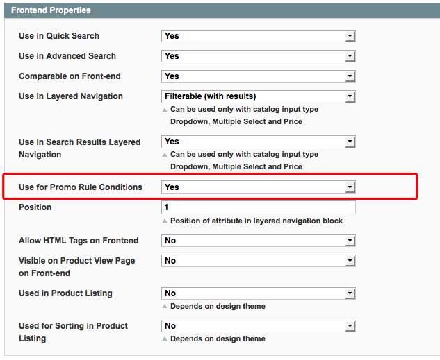
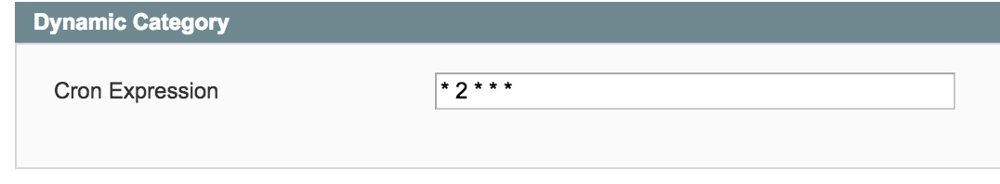

<!-- ALL-CONTRIBUTORS-BADGE:START - Do not remove or modify this section -->
[](#contributors-)
<!-- ALL-CONTRIBUTORS-BADGE:END -->
# FireGento_DynamicCategory

DynamicCategory is a **free community module** for Magento which allows you to add automatically products to a category, thanks to a set of rules based on the product attribute.

The interface to set the rules is very similar to the one to create shopping cart rules. See the [**Usage**](#usage) Chapter below to see how to use it.

## Facts

- Version: 1.2.2
- [extension on GitHub](https://github.com/firegento/firegento-dynamiccategory)

The module adds a new section "Dynamic Category Product Relater" at the tab "Category Products" of categories in the backend.
You can define rules for products to be included in the category.

If a rule should be defined according to a specific attribute, that attribute needs to be enabled for "Use for Promo Rule Conditions" in its attribute configuration.

## Requirements

- PHP >= 5.3.0

## Compatibility

- Magento >= 1.6

## Installation Instructions

### Via modman

- Install [modman](https://github.com/colinmollenhour/modman)
- Use the command from your Magento installation folder: `modman clone https://github.com/firegento/firegento-dynamiccategory`
- Please make sure that the setting "Allow Symlinks" in System Configuration under *Developer -> Template Settings* is set to "YES".

### Via composer
- Install [composer](http://getcomposer.org/download/)
- Install [Magento Composer](https://github.com/magento-hackathon/magento-composer-installer)
- Create a composer.json into your project like the following sample:

```json
{
    ...
    "require": {
        "firegento/dynamiccategory":"*"
    },
    "repositories": [
	    {
            "type": "composer",
            "url": "http://packages.firegento.com"
        }
    ],
    "extra":{
        "magento-root-dir": "./"
    }
}
```

- Then from your `composer.json` folder: `php composer.phar install` or `composer install`

### Via modgit

- Install [modgit](https://github.com/jreinke/modgit)
- Use the command from your Magento installation folder: `modgit add -i src/app/:app/ -b develop Firegento_DynamicCategory https://github.com/firegento/firegento-dynamiccategory`
- Please make sure that the setting "Allow Symlinks" in System Configuration under *Developer -> Template Settings* is set to "YES".

### Manually
- You can copy the files from the folders of this repository to the same folders of your installation


### Installation in ALL CASES
1. Clear the cache, logout from the admin panel and then login again.
2. You can now dynamically add products to categories based on attributes.

## Uninstallation

1. Remove all extension files from your Magento installation
2. Run the following sql script in your database:

```sql
DROP TABLE dynamiccategory_rule;
DELETE FROM eav_attribute WHERE attribute_code = 'dynamiccategory';
```

<a name="usage">
Usage
-----

### How to use in category management

The module adds a new section "Dynamic Category Product Relater" at the tab "Category Products" while reading or editing a category into the backend.
You can define rules for products to be included in the category.



To define a rule, click on the `+` button and add one or more attributes then fill which value(s) must be valid or not to make the condition TRUE. Then it will apply the product to the current category if conditions are ok. You can set if it must be applied when only one or all conditions are valid.

When you finished to define the rules, save the current category.

### How to setup an attribute to be available for Dynamic Category

If a rule should be defined according to a specific attribute, that attribute needs to be enabled for "Use for Promo Rule Conditions" in its attribute configuration (See Catalog > Attributes > YOUR ATTRIBUTE > Edit it).




### Cronjob

By default, there is a cronjob which runs every morning at 2 a.m. to reindex all dynamic categories.

If you want to change this time, please go to *System > Configuration > Advanced > System > Dynamic Category* and 
change the cron expression.




## Support

If you have any issues with this extension, open an issue on [GitHub](https://github.com/firegento/firegento-customer/issues).

## Developer

FireGento Team
* Website: [http://firegento.com](http://firegento.com)
* Twitter: [@firegento](https://twitter.com/firegento)

## Contribution

Any contribution is highly appreciated. The best way to contribute code is to open a [pull request on GitHub](https://help.github.com/articles/using-pull-requests).


## Contributors ✨

Thanks goes to these wonderful people ([emoji key](https://allcontributors.org/docs/en/emoji-key)):

<!-- ALL-CONTRIBUTORS-LIST:START - Do not remove or modify this section -->
<!-- prettier-ignore-start -->
<!-- markdownlint-disable -->
<table>
  <tr>
    <td align="center"><a href="https://rouven.io/"><br /><sub><b>Rouven Alexander Rieker</b></sub></a><br /><a href="https://github.com/firegento/firegento-dynamiccategory/commits?author=therouv" title="Code">💻</a></td>
    <td align="center"><a href="http://www.flagbit.de/"><br /><sub><b>Jörg Weller</b></sub></a><br /><a href="https://github.com/firegento/firegento-dynamiccategory/commits?author=hackwell" title="Code">💻</a></td>
    <td align="center"><a href="https://www.diglin.com/"><br /><sub><b>Sylvain Rayé</b></sub></a><br /><a href="https://github.com/firegento/firegento-dynamiccategory/commits?author=sylvainraye" title="Code">💻</a></td>
    <td align="center"><a href="https://www.reachdigital.nl/"><br /><sub><b>Paul Hachmang</b></sub></a><br /><a href="https://github.com/firegento/firegento-dynamiccategory/commits?author=paales" title="Code">💻</a></td>
    <td align="center"><a href="http://vinaikopp.com/"><br /><sub><b>Vinai Kopp</b></sub></a><br /><a href="https://github.com/firegento/firegento-dynamiccategory/commits?author=Vinai" title="Code">💻</a></td>
    <td align="center"><a href="http://www.integer-net.de/agentur/andreas-von-studnitz/"><br /><sub><b>Andreas von Studnitz</b></sub></a><br /><a href="https://github.com/firegento/firegento-dynamiccategory/commits?author=avstudnitz" title="Code">💻</a></td>
    <td align="center"><a href="https://macopedia.com/"><br /><sub><b>Tymoteusz Motylewski</b></sub></a><br /><a href="https://github.com/firegento/firegento-dynamiccategory/commits?author=tmotyl" title="Code">💻</a></td>
  </tr>
  <tr>
    <td align="center"><a href="https://rafaelcg.com/"><br /><sub><b>Rafael Corrêa Gomes</b></sub></a><br /><a href="https://github.com/firegento/firegento-dynamiccategory/commits?author=rafaelstz" title="Code">💻</a></td>
    <td align="center"><a href="http://www.twitter.com/s3lf"><br /><sub><b>Alexander Menk</b></sub></a><br /><a href="https://github.com/firegento/firegento-dynamiccategory/commits?author=amenk" title="Code">💻</a></td>
    <td align="center"><a href="https://github.com/JosVerhaar"><br /><sub><b>JosVerhaar</b></sub></a><br /><a href="https://github.com/firegento/firegento-dynamiccategory/commits?author=JosVerhaar" title="Code">💻</a></td>
    <td align="center"><a href="https://github.com/kkrieger85"><br /><sub><b>Kevin Krieger</b></sub></a><br /><a href="https://github.com/firegento/firegento-dynamiccategory/commits?author=kkrieger85" title="Documentation">📖</a></td>
  </tr>
</table>

<!-- markdownlint-enable -->
<!-- prettier-ignore-end -->
<!-- ALL-CONTRIBUTORS-LIST:END -->

This project follows the [all-contributors](https://github.com/all-contributors/all-contributors) specification. Contributions of any kind welcome!

## License

[GNU General Public License, version 3 (GPLv3)](http://opensource.org/licenses/gpl-3.0)

## Copyright

(c) 2012-2020 FireGento Team
